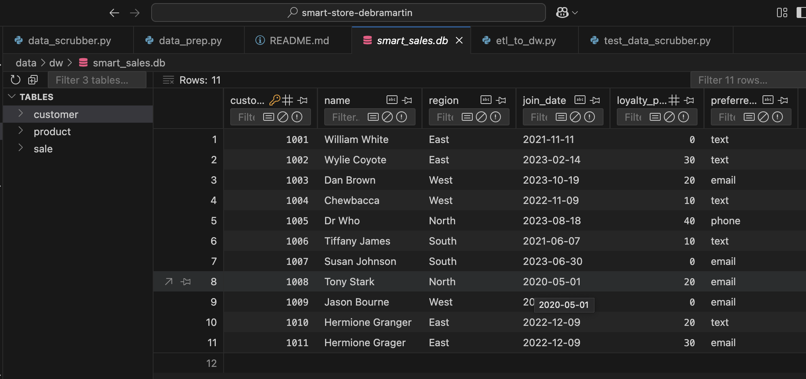
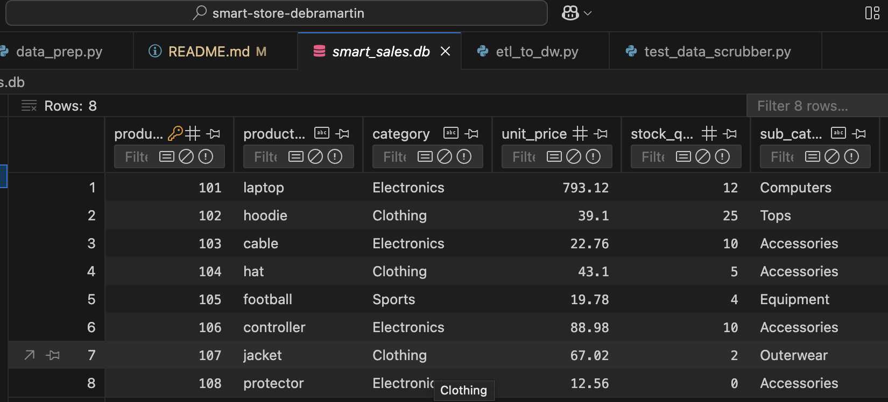
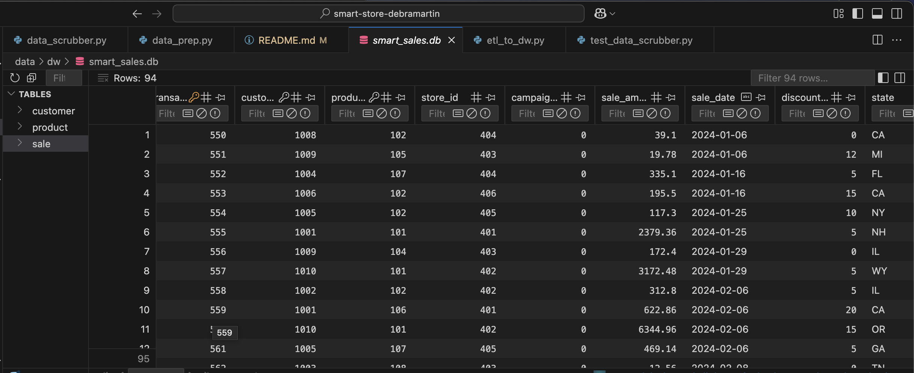
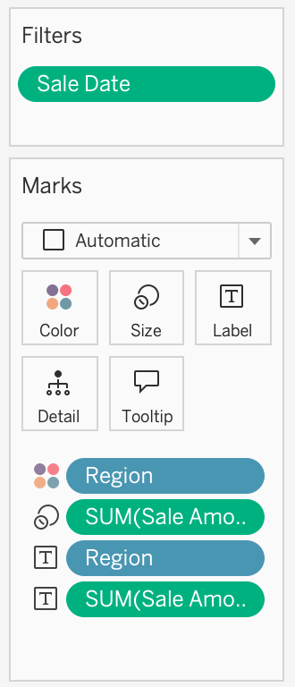
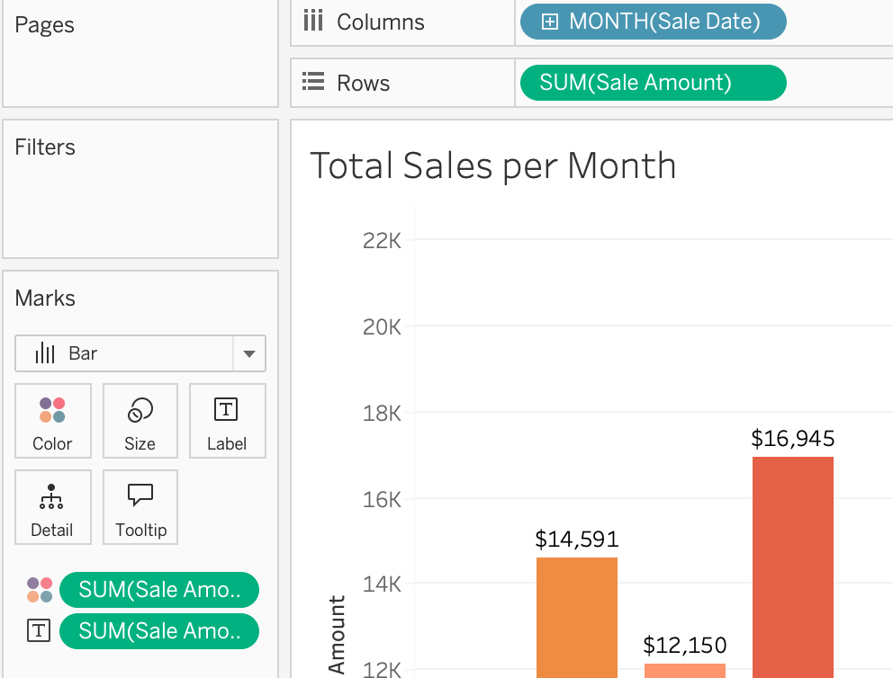
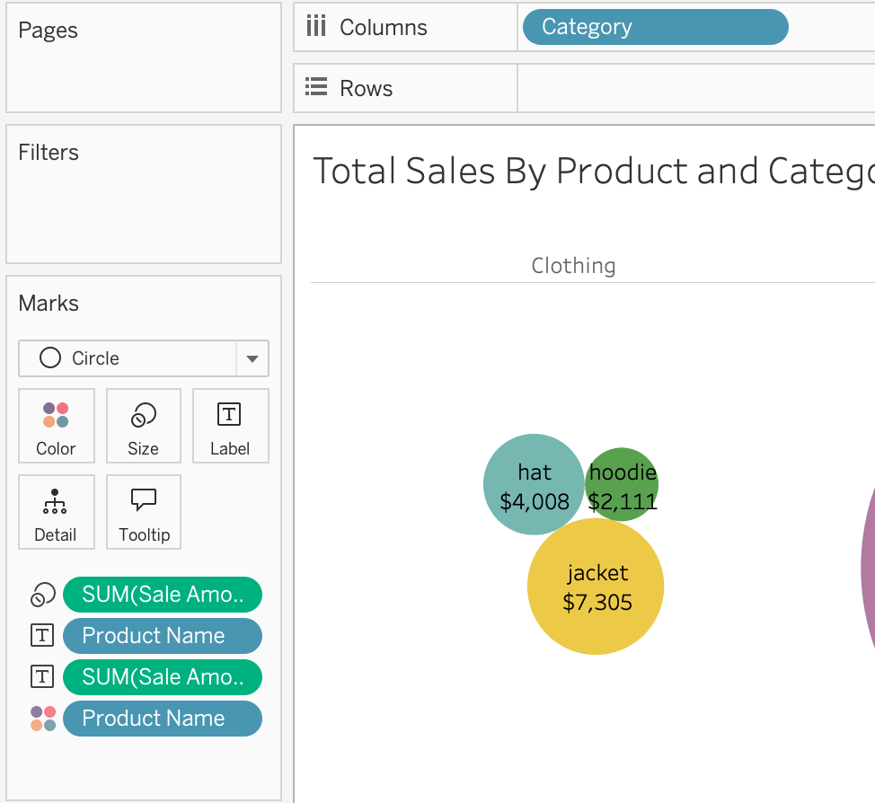
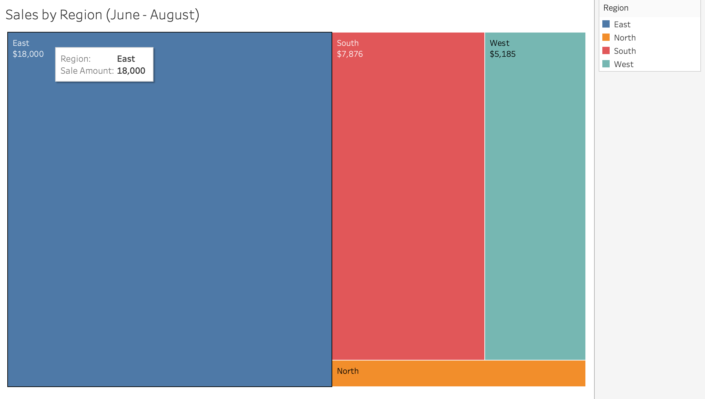
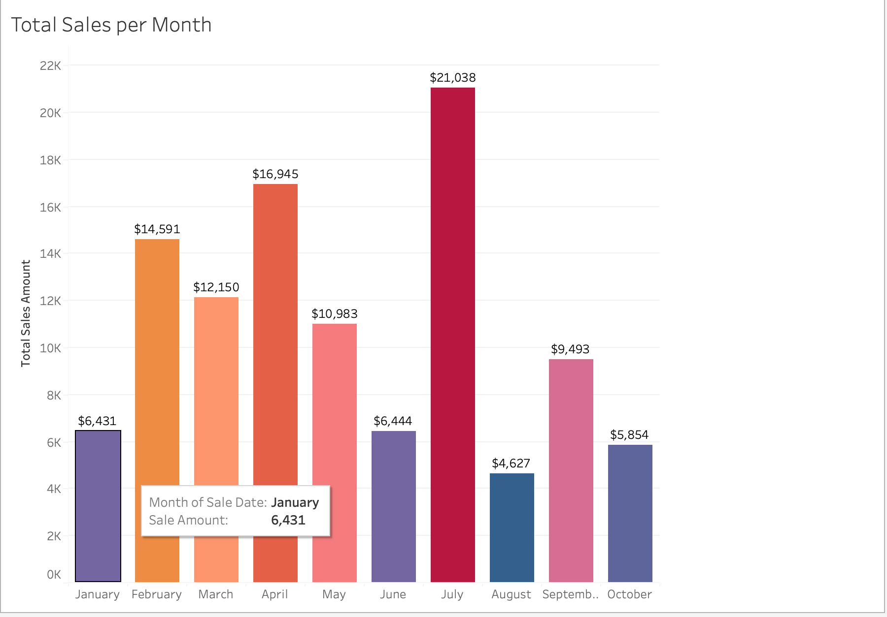
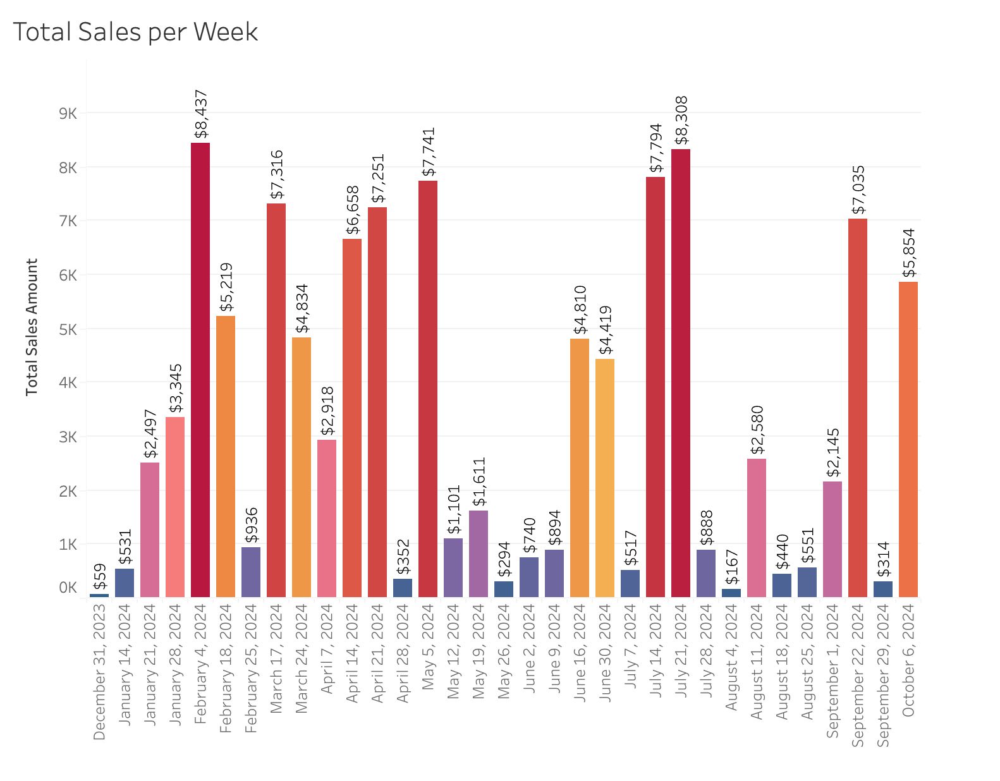
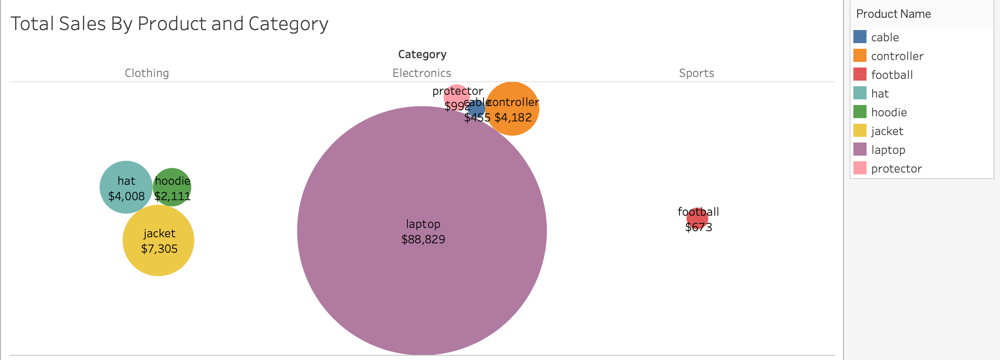

# smart-store-debramartin
# 01-git-pull-before-changes.md

Before making any changes to a project, ALWAYS pull the latest changes from the remote repository on GitHub. Keep both locations up-to-date and in sync. 

Pulling ensures that:
- You work with the latest code.
- Merge conflicts are minimized.
- Collaboration stays smooth.

## Before Starting

Open your project repository in VS Code. 

We'll open a new terminal in VS Code and run a single command. 

## Task 1. Pull Changes

Run the following command from the project root directory. 
The command works in PowerShell, bash, zsh, Git Bash, and more. 

```shell
git pull origin main
```

Once configured, you might find that a shorter version works as well: `git pull`

Review the output for updates or conflicts. 
If there are conflicts, resolve them before proceeding.
The best solution to merge conflicts is to AVOID them through a good workflow. 
# 02-activate-virtual-environment.md

ALWAYS activate the .venv before working on the project.Activate whenever you open a new terminal. 

## Before Starting

Open your project repository in VS Code. 

We'll open a new terminal in VS Code and run a single command. 

## Windows Machines: Task 1. Activate

Run the following command from the project root directory. 
The command works in PowerShell.

```powershell
.venv\Scripts\activate
```

## Mac/Linux Machines: Task 1. Activate

Run the following command from the project root directory. 
The command works in zsh, bash, and more.

```powershell
source .venv/bin/activate
```

## Verify
Confirm activation by checking that the terminal shows the environment name (e.g., (venv)).

## Recommendation

This command is a bit harder to memorize. Use the UP ARROW key to access prior commands in the terminal and keep good notes in your README.md files. 
# 03-install-dependencies.md

This page explains how to install external dependencies for a Python project. 

## Python Standard Library
We do not need to install packages from the Python Standard Library - they are included with our version. The standard library includes helpful packages like pathlib, sqlite3, os, sys, time, and more. See the index. 

## External Dependencies
External dependencies are libraries, packages, and modules beyond the standard library and include common packages like pandas, numpy, seaborn, and matplotlib. 

These must be installed into our local project virtual environment to use them in our code. 

## Before Starting

Open your project repository in VS Code. 
Open a terminal. 
We must activate the .venv - if you've already done so, you don't need to rerun that command. 


## Windows Task 1: Activate/Upgrade/Install

1. Ensure .venv is active.
2. Update key packages.
3. Install dependencies from the requirements.txt file.

Run the following commands from the project root directory. 
The commands work in PowerShell.

```powershell
.\.venv\Scripts\activate
py -m pip install --upgrade pip setuptools wheel
py -m pip install -r requirements.txt
```


## Mac/Linux Task 1: Activate/Upgrade/Install

1. Ensure .venv is active.
2. Update key packages.
3. Install dependencies from the requirements.txt file.

Run the following commands from the project root directory. 
The commands work in zsh, bash, and more.

```powershell
source .venv/bin/activate
python3 -m pip install --upgrade pip setuptools wheel
python3 -m pip install -r requirements.txt
```

## Dependencies Evolve Over Time
Which external packages we need tend to evolve over time.
We don't always know the full list when we begin. 
For example, it's common to add in matplotlib or seaborn once we have interesting results to visualize.

## Experience
Learn how and when to add external dependencies to requirements.txt and repeat this process as needed to make use of the powerful free ecosystem for Python projects. 
Explore popular external packages like requests and more to see why they get used. 
# 06-git-add-commit-push.md

This page provides instructions to add files to version control, commit changes, and push them to your remote repository.

- git add - stages changes, adds files to source control
- git commit - creates a labeled snapshot of staged changes.
- git push - updates the remote repository

## Before Starting

Ensure your project repository is open in VS Code, and you have made useful changes.

## Task 1. Git add-commit-push

Using a terminal in VS Code (PowerShell, zsh, or bash).

IMPORTANT: 
Replace the commit message with a clear and descriptive note about what you added or changed.
Wrap the commit message in double quotes. 

```shell
git add .
git commit -m "Add .gitignore and requirements.txt files"
git push -u origin main
```

After subsequent changes, you may be able to use a simpler version of the last command:

```shell
git push
``` 


## Experience

Experience comes from executing these commands frequently after making useful changes to a project. 

## 14. Data Warehouse (DW) Creation and Data Upload

### 14.1 Create and Configure SQLite Database
1. The SQLite database `smart_sales.db` is created in the `data/dw/` directory.
2. The schema includes the following tables:
   - `customer`
   - `product`
   - `sale`

### 14.2 Database Schema

#### **customer Table**
| Column Name       | Data Type  | Description                          |
|------------------|-----------|--------------------------------------|
| `customer_id`   | INTEGER (PK) | Unique ID for each customer |
| `name`          | TEXT       | Customer's full name |
| `region`        | TEXT       | Region of the customer |
| `join_date`     | TEXT       | Customer's sign-up date |
| `loyalty_points` | INTEGER    | Loyalty points accumulated |
| `preferred_contact_method` | TEXT       | Customer segment (email, text, phone) |


#### **product Table**
| Column Name     | Data Type  | Description                     |
|----------------|-----------|---------------------------------|
| `product_id`   | INTEGER (PK) | Unique ID for each product |
| `product_name` | TEXT       | Name of the product |
| `category`     | TEXT       | Product category (Electronics, Clothing, etc.) |
| `unit_price`   | REAL       | Price per unit |
| `stock_quantity` | INTEGER    | Available stock count |
| `sub_category`     | TEXT       | Subcategory of product|

#### **sale Table**
| Column Name       | Data Type  | Description                              |
|------------------|-----------|------------------------------------------|
| `transaction_id`       | INTEGER (PK) | Unique sale transaction ID |
| `customer_id`   | INTEGER (FK) | ID of the customer making the purchase |
| `product_id`    | INTEGER (FK) | ID of the product sold |
| `sale_amount`   | REAL       | Sale amount after discount |
| `sale_date`         | TEXT       | Date of sale |
| `store_id`     | INTEGER    | Store where the sale occurred |
| `campaign_id`  | INTEGER    | Marketing campaign ID if applicable |
| `discount_percent` | REAL  | Discount applied to the sale |
| `state` | TEXT       | State of sale |

### 14.3 Load Data into the Data Warehouse
1. Prepared data files are loaded into the SQLite database using `etl_to_dw.py`:
   ```sh
   python scripts/etl_to_dw.py





# SQLite Data Warehouse


## Project Overview

This project involves designing and implementing a **Data Warehouse** using SQLite. It includes:

- Schema creation
- ETL (Extract, Transform, Load) scripting
- Data validation and testing

## Database Schema

The schema is designed to support efficient data storage and retrieval. The key components include:

- **Fact Tables**: Stores transactional data.
- **Dimension Tables**: Contains categorical details for analysis.

## ETL Process

The ETL pipeline follows these stages:

1. **Extract**: Data is sourced from various input sources.
2. **Transform**: Data is cleaned and formatted to match the schema.
3. **Load**: Transformed data is inserted into the warehouse.

## Validation & Testing

- **Schema validation** ensures data integrity.
- **Automated testing** checks for consistency and accuracy.
- **Performance benchmarking** ensures optimized queries.

## Setup & Installation

To set up the SQLite data warehouse:

1. Clone this repository:
   ```sh
   git clone https://github.com/teflxndxn/smart-store-debramartin
   ```
2. Install SQLite if not already installed.
3. Execute the schema script using Python 3:
   ```sh
   python3 scripts/etl_to_dw.py
   ```

## Usage Instructions

- Run ETL scripts using Python or shell scripts.
- Query data using SQL for reporting and analytics.
- Validate results with test scripts.


### 📊 SQL Queries and Reports

To generate meaningful insights, I used **Spark SQL** to join the three main tables: `sale`, `product`, and `customer` to combine data across the tables.

One of the key queries I used was to calculate the **total amount spent by each customer**. This involved joining the `sale` and `customer` tables and grouping the data by customer name:

```python
df_top_customers = spark.sql("""
SELECT c.name, SUM(s.sale_amount) AS total_spent
FROM sale s
JOIN customer c ON s.customer_id = c.customer_id
GROUP BY c.name
ORDER BY total_spent DESC
""")


# OLAP Project


## 1 - The Business Goal

Analyze the total sales for each region for the summer months to determine future inventory and production needed for individual stores during the summer.
Examine total sales per month for the year as well as per week to identify any cycles in sales to determine production needed to increase efficiency.
Use total sales per category and product to identify the contribution of products and categories to the overall sales for the company.  This information can guide marketing and future product offerings for the company.

## 2 - Data Source


I used the prepared data files and joined them in Tableau Prep.  Columns used were sale_amount, sale_date, category, region, product_id, and product_name.

## 3 - Tools

I used Tableau Prep and Tableau because I prefer the visualizations and ease of use of Tableau.

## 4 - Workflow & Logic
---
Sales by Region (June-August): dimensions - region, aggregation - sum of sales.  This was sliced to only show sales for the summer months.



Total Sales per Month and Week: dimensions - sales date, aggregation - sum of sales.  This shows a drill down from monthly to weekly.



Total Sales by Product and Category: dimensions - product id and category, aggregation - sum of sales.  This shows dicing.



## 5 - Results




More than half of the total sales in the summer months occurs in the East region.




The company sees the highest sales in July and also in February - April.




This visualization shows drilled down data from the previous visualization.




The company makes the largest portion of its sales by selling laptops and have very little sales outside the electronics category.

## 6 - Suggested Business Action

Sales by Region (June-August):  I recommend for the company to plan in the summer months to send extra stock to the stores in the East region to decrease any lost sales from items being out of stock.

Sales by Month and Week:  I recommend using this data to calculate needed production rates to builda surplus during slower months to help avoid any out of stock issues in the stores in July, February, March, and April.

Total Sales by Product and Category:  I recommend the company analyze the sales for the clothing and sports categories and align future goals.  If they want to expand those categories, I would recommend more marketing in hopes of boosting sales.  The company has the majority of sales in electronics and specifically in laptops.

## 7 - Challenges

I had to refamiliarize myself with Tableau but it came back quickly.  I did not have any issued loading the data or creating the visualizations in Tableau.